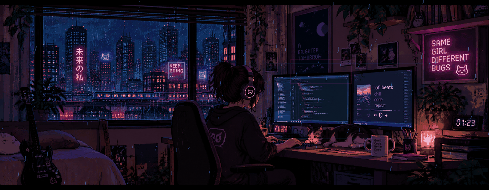

  

## I love building games, experimenting with gameplay ideas, and turning random concepts into something you can actually play. I'm currently exploring Unity, programming, AI, and game development.
## 🛠️ Tech Stack

  

<!--
**sherlyn-does/sherlyn-does** is a ✨ _special_ ✨ repository because its `README.md` (this file) appears on your GitHub profile.

Here are some ideas to get you started:

- 🔭 I’m currently working on ...
- 🌱 I’m currently learning ...
- 👯 I’m looking to collaborate on ...
- 🤔 I’m looking for help with ...
- 💬 Ask me about ...
- 📫 How to reach me: ...
- 😄 Pronouns: ...
- ⚡ Fun fact: ...
-->
